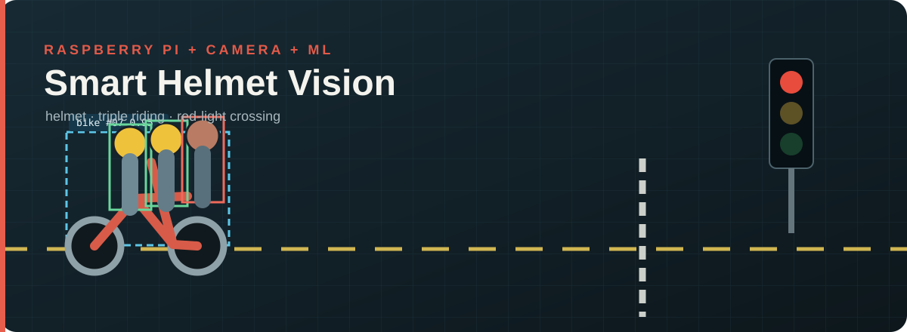

<p align="center">
  
</p>

# Smart Helmet Vision

This started as an internship research task. I didn't want to submit only a document or a notebook, so I made a small working demo too.

The project watches motorcycles and riders in video and checks three things: helmet use, triple riding and crossing the stop line while the signal is red. The website can now run the two detection models on a video selected from your device. The Python folder is where the camera, tracking and full rule-engine work lives.

<p align="center">
  
</p>

<table>
  <tr>
    <td align="center" width="33%"><b>Helmet check</b><br><sub>Waits for the result to stay consistent</sub></td>
    <td align="center" width="33%"><b>Triple riding</b><br><sub>Associates riders with one bike track</sub></td>
    <td align="center" width="33%"><b>Signal crossing</b><br><sub>Checks line crossing only during red</sub></td>
  </tr>
</table>

## What is here

The first part of the website is a normal video player with a file picker. YOLO11 finds motorcycles and people in the current frame, while a lightweight YOLOv8n helmet model predicts `With Helmet` or `Without Helmet`. The boxes are drawn live in the browser; they are not part of the video. The selected file stays on the device and is not uploaded. The page also keeps five small simulated cases so each rule is easy to test on demand.

One small thing before trying it: wait until the note above the video turns green and says **“Models ready.”** The page loads the traffic model first and the helmet model second, and shows the current step beside the video. The sample and file buttons stay unavailable until that is finished. Once the green message appears, play the sample or choose your own video.

The `backend` folder has the Python code for video input, tracking, rider-to-bike matching, stop-line crossing, event confirmation and saving evidence. It also has a small deterministic simulation and six unit tests.

At the moment:

- MP4, WebM and other browser-supported videos can be selected from the page;
- both ONNX models run locally in the browser;
- the website builds and runs;
- the combined demo gives all three expected events;
- all six Python tests pass;
- Raspberry Pi speed testing and training on footage from the final camera angle are still left to do.

The original 80 MB helmet model stalled in some browsers, so I replaced it with an approximately 12 MB browser export and changed loading to happen one model at a time. Inference speed still depends on the laptop or phone. The counts are suggestions from the models, not verified ground truth. Signal jumping is not guessed for arbitrary uploads because that rule needs a fixed, calibrated stop line and signal region.

I also made the live check intentionally conservative. The browser first finds motorcycles at 320 × 320, silently ignores bikes that are too small in the frame, and runs the helmet model only around the nearest close rider group. A visible helmet or no-helmet label needs stronger confidence and the same result in two consecutive checks. Inference runs away from the playback thread and the page checks a new frame about twice per second, so the video can keep playing smoothly. The canvas only shows confirmed green or red helmet results; working boxes and stale results are cleared instead of being left over the next frame. The numbers beside the video are running totals for the current video and reset when another video is selected. Very strong no-helmet detections are tracked separately so one rider adds one case instead of being added on every frame.

## Running the website

You need a recent Node.js version and pnpm.

```bash
pnpm install
pnpm dev
```

For the same production build Vercel will use:

```bash
pnpm build
pnpm preview
```

## Checking the Python logic

```bash
cd backend
python helmet_system.py --demo
python -m unittest -v test_helmet_system.py
```

The controlled simulation should print one event for each rule:

```text
NO_HELMET
TRIPLE_RIDING
RED_LIGHT_CROSSING
```

## Trying a real video

For the quickest test, open the deployed page, wait for the green **Models ready** message, then press play on the built-in sample. You can use **Choose your video** after that. The video remains on your device.

Install the Python packages first:

```bash
cd backend
python -m pip install -r ml-requirements.txt
```

Then give the program a video/camera source, a general tracking model and the helmet model:

```bash
python helmet_system.py \
  --source path/to/video.mp4 \
  --model path/to/yolo11n.pt \
  --helmet-model path/to/helmet-model.pt \
  --signal unknown \
  --save-video annotated.mp4 \
  --display
```

A normal object-detection model is not enough for helmet compliance, which is why the demo uses a second model. For a fixed junction, camera regions and the stop line can be changed in `backend/traffic_demo.json`. Use `--signal auto` only after setting the signal region for that camera.

## Training direction

I used AI City Challenge 2024 Track 5 as the main dataset reference. The conversion script prepares the annotations for a YOLO-style training setup:

```bash
cd backend
python training.py convert \
  --frames-root path/to/frames \
  --annotations path/to/groundtruth.txt \
  --out data/aicity_yolo

python training.py train \
  --data data/aicity_yolo/dataset.yaml \
  --model yolo11n.pt \
  --epochs 50 \
  --export ncnn
```

Training should be done on a laptop GPU or cloud notebook. The smaller exported model can then be measured on the Raspberry Pi for FPS, latency and heat.

## Project layout

```text
src/App.tsx                browser demo and page entry
src/styles.css             page styling and motion
backend/helmet_system.py   camera, rules and controlled demo
backend/training.py        dataset conversion and training
backend/test_helmet_system.py
public/sample-traffic.mp4     normal unmarked sample video
public/models/                browser-ready ONNX models
assets/                    two SVG artwork files
```

## Deploying it

Push the repository to GitHub, open Vercel, choose **New Project**, and import this repo. Vercel should detect Vite automatically. The build command is `pnpm build` and the output directory is `dist`.

## References I used

- [AI City Challenge 2024 — Track 5](https://www.aicitychallenge.org/2024-data-and-evaluation/)
- [Raspberry Pi AI Camera documentation](https://www.raspberrypi.com/documentation/accessories/ai-camera.html)
- [Ultralytics Raspberry Pi and NCNN guide](https://docs.ultralytics.com/guides/raspberry-pi)
- [Ultralytics tracking mode](https://docs.ultralytics.com/modes/track/)
- [MIT-licensed lightweight helmet model used for the real demo](https://huggingface.co/iam-tsr/yolov8n-helmet-detection)
- [Pexels source video by Aamir Somewhere](https://www.pexels.com/video/busy-indian-street-with-traffic-and-motorbikes-34394424/)
- [Motor Vehicles Act, 1988 — India Code](https://www.indiacode.nic.in/handle/123456789/13700?locale=en)

## One honest limitation

The rule engine is tested, but I am not calling this a finished traffic-enforcement system. Real accuracy numbers need trained weights and test footage from the actual road/camera angle. Any event should go to a person for review; it should not become an automatic challan or an identity-recognition system.
